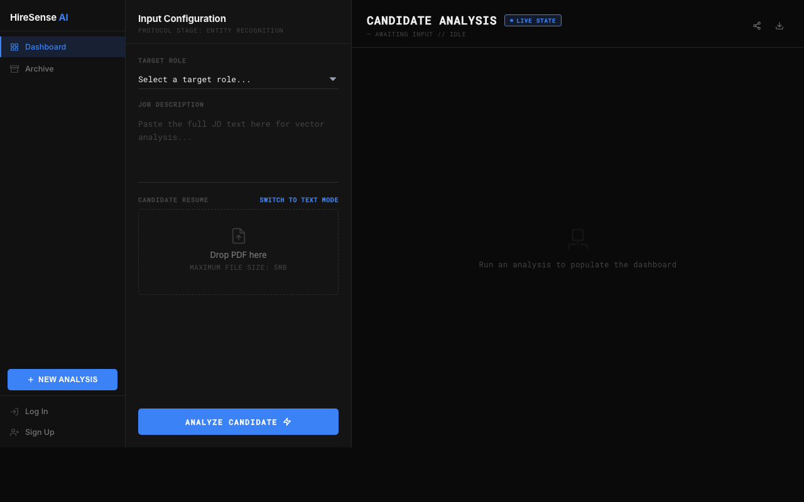
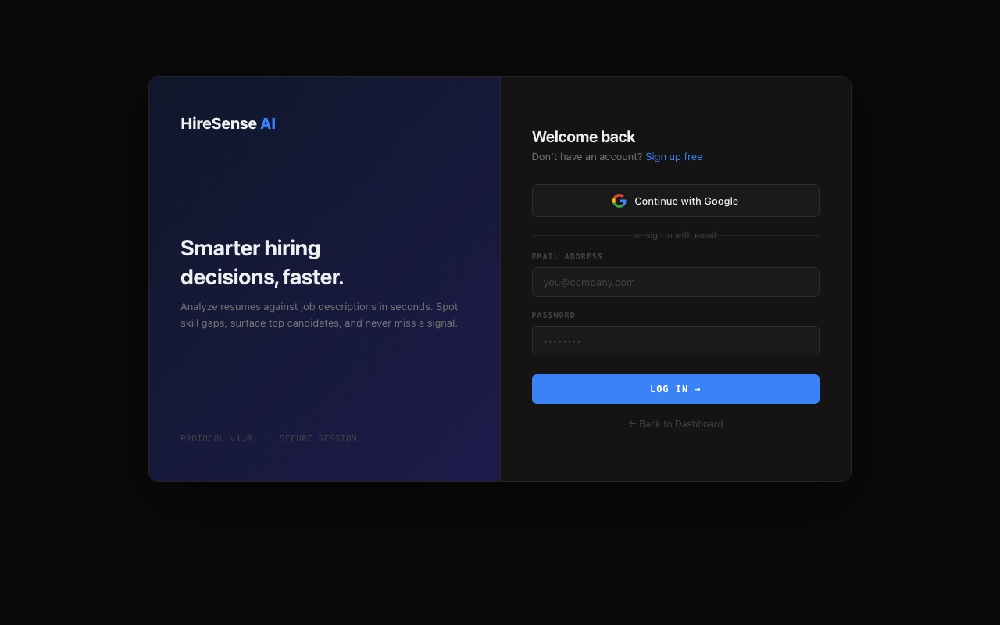

HireSense is an AI-powered platform that analyzes, scores, and auto-tailors resumes against job descriptions to maximize ATS success.
Optimize your job hunt with real-time AI feedback, semantic alignment insights, and one-click tailored PDF exports.

---

## 📸 Screenshots

### Dashboard / Resume Analyzer

### User Authentication / Login

---

## ✨ Features

- **Smart ATS Scoring:** Extracts text from PDF or raw input and evaluates it against target job descriptions.
- **Auto-Tailoring:** Uses advanced LLMs via OpenRouter to intelligently recommend and rewrite resume bullets.
- **Detailed Actionable Feedback:** Provides insights into missing keywords, tone improvements, and formatting suggestions.
- **User Authentication:** Secure access utilizing both Email/Password (Flask-Login) and Google OAuth integrations.
- **History Tracking:** Securely logs your previous analyses, job listings, and generated resume templates in a local SQLite database for easy access.

## 🛠 Tech Stack

- **Backend:** Python, Flask, Flask-Login, Authlib
- **Database:** SQLite3
- **Frontend:** HTML5, CSS3, Vanilla JavaScript (Premium, Minimalist "Vibe-coded" Aesthetic)
- **AI Integration:** OpenRouter API (Accessing various frontier LLM models)
